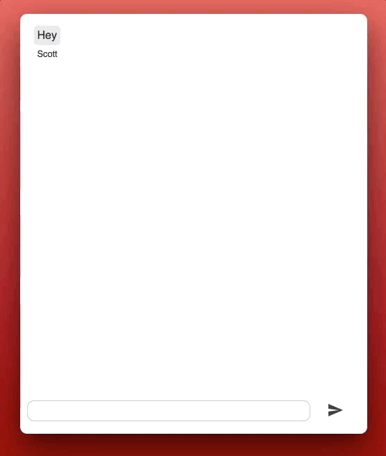

# Svelte Chat

An example app built with [Svelte.js](https://svelte.technology/), using Socket.io to provide the chat functionality.

To try it out, clone/download this repo, run `yarn`, and then run both `yarn dev` and `yarn start:api`.

Note that you must have both [yarn](https://yarnpkg.com/en/) and MongoDB installed to run.

